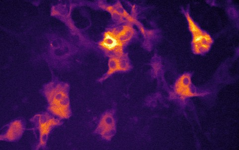

# Astral

## An application for detecting and analyzing signalling events from microscopic time-lapse images of astrocytes and other cell types.

#### In collaboration with Silesian University of Technology and NeuroScienceLab Essen
